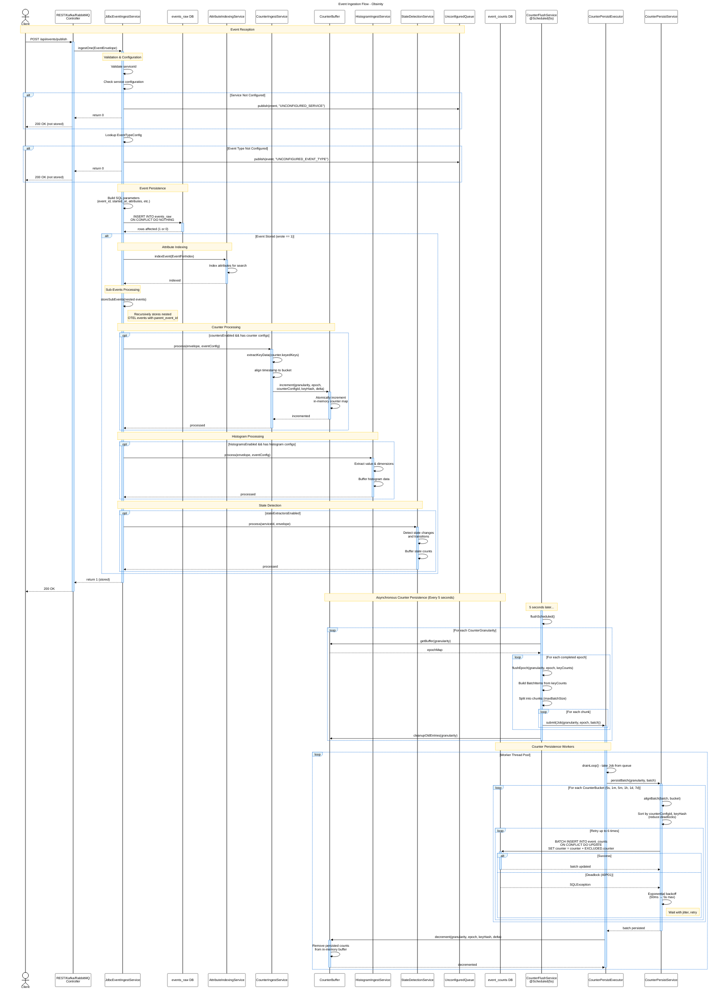

# Event Ingestion Flow - Obsinity

This document describes the complete event ingestion and counter processing flow in Obsinity, from initial event reception through persistence and asynchronous aggregation.

## Overview

The event ingestion process consists of several key phases:

1. **Event Reception** - Events arrive via REST API, Kafka, or RabbitMQ
2. **Validation & Configuration** - Service and event type validation
3. **Event Persistence** - Storage in the `events_raw` table
4. **Synchronous Processing** - Attribute indexing, counters, histograms, and state detection
5. **Asynchronous Counter Persistence** - Scheduled rollup and database writes

## Architecture Components

### Core Services

- **JdbcEventIngestService** - Main orchestrator for event ingestion
- **CounterIngestService** - Extracts counter dimensions and buffers in memory
- **CounterBuffer** - In-memory concurrent counter accumulation
- **CounterFlushService** - Scheduled service (every 5s) to flush completed buckets
- **CounterPersistExecutor** - Multi-threaded worker pool for database writes
- **CounterPersistService** - Batch persistence with deadlock retry logic

### Database Tables

- **events_raw** - Stores all raw events with attributes
- **event_counts** - Pre-aggregated counter rollups (5s, 1m, 5m, 1h, 1d, 7d)

## Sequence Diagram



## Key Implementation Details

### Event Persistence (JdbcEventIngestService)

**Location:** `obsinity-service-core/src/main/java/com/obsinity/service/core/impl/JdbcEventIngestService.java`

```java
// Main ingestion method - line 87
public int ingestOne(EventEnvelope e) {
    // Validation
    // Event persistence to events_raw
    final int wrote = jdbc.update(INSERT_SQL, p);
    
    if (wrote == 1) {
        // Attribute indexing
        attributeIndexingService.indexEvent(...);
        
        // Counter processing
        if (countersEnabled) {
            counterIngestService.process(e, eventConfig);
        }
        
        // Histogram processing
        if (histogramsEnabled) {
            histogramIngestService.process(e, eventConfig);
        }
        
        // State detection
        if (stateExtractorsEnabled) {
            stateDetectionService.process(serviceId, e);
        }
    }
    
    return wrote;
}
```

### Counter Buffer (In-Memory)

**Location:** `obsinity-service-core/src/main/java/com/obsinity/service/core/counter/CounterBuffer.java`

```java
// Concurrent in-memory counter storage
private final EnumMap<CounterGranularity, 
    ConcurrentMap<Long, ConcurrentMap<String, BufferedCounterEntry>>> buffers;

public void increment(CounterGranularity granularity, long epoch, 
                     UUID counterConfigId, UUID eventTypeId,
                     String keyHash, long value, Map<String, String> keyData) {
    var epochMap = buffers.get(granularity)
        .computeIfAbsent(epoch, k -> new ConcurrentHashMap<>());
    
    epochMap.compute(keyHash, (k, existing) -> {
        if (existing == null) {
            return new BufferedCounterEntry(counterConfigId, eventTypeId, 
                                           keyHash, keyData, value);
        }
        return new BufferedCounterEntry(counterConfigId, eventTypeId, keyHash, 
                                       existing.keyData(), 
                                       existing.counter() + value);
    });
}
```

### Counter Persistence (Database)

**Location:** `obsinity-service-core/src/main/java/com/obsinity/service/core/counter/CounterPersistService.java`

```java
// Batch persistence with rollup buckets
public void persistBatch(CounterGranularity baseGranularity, List<BatchItem> batch) {
    EnumSet<CounterBucket> buckets = baseGranularity.materialisedBuckets();
    
    // Process from smallest to largest to reduce lock contention
    for (CounterBucket bucket : orderedBuckets) {
        List<BatchItem> aligned = alignBatch(batch, bucket);
        
        String sql = """
            INSERT INTO obsinity.event_counts 
                (ts, bucket, counter_config_id, event_type_id, key_hash, key_data, counter)
            VALUES (?, ?, ?, ?, ?, ?::jsonb, ?)
            ON CONFLICT (ts, bucket, counter_config_id, key_hash)
            DO UPDATE SET counter = obsinity.event_counts.counter + EXCLUDED.counter
            """;
        
        executeBatchWithRetry(sql, aligned, bucket);
    }
}
```

### Deadlock Retry Logic

```java
// Exponential backoff with deadlock detection
private void executeBatchWithRetry(String sql, List<BatchItem> aligned, 
                                   CounterBucket bucket) {
    // Stable ordering reduces lock-order deadlocks
    aligned.sort(Comparator.comparing(BatchItem::counterConfigId)
                          .thenComparing(BatchItem::keyHash));
    
    int attempts = 0;
    int maxAttempts = 6;
    
    while (true) {
        attempts++;
        try {
            jdbcTemplate.batchUpdate(sql, new BatchPreparedStatementSetter() {...});
            return; // Success
        } catch (DataAccessException ex) {
            if (attempts >= maxAttempts || !isDeadlock(ex)) {
                throw ex;
            }
            // Exponential backoff: 50ms → 100ms → 200ms → ... (max 5s)
            long backoffMs = calculateBackoff(attempts);
            Thread.sleep(backoffMs);
        }
    }
}
```

## Configuration

### Counter Processing Settings

```yaml
obsinity:
  counters:
    enabled: true
    flush:
      rate.s5: 5000  # Flush every 5 seconds
      maxBatchSize: 1000
    persist:
      queueCapacity: 10000
      workers: 4  # Worker threads for persistence
```

### Counter Granularities

Each counter is materialized at multiple time resolutions:

- **5s** - 5-second buckets (base granularity)
- **1m** - 1-minute rollups
- **5m** - 5-minute rollups
- **1h** - 1-hour rollups
- **1d** - 1-day rollups
- **7d** - 7-day rollups

## Performance Characteristics

### Throughput Optimization

1. **In-Memory Buffering** - Events are counted in memory first, avoiding database writes on every event
2. **Batch Processing** - Counters are flushed in batches (configurable batch size)
3. **Multi-Threaded Persistence** - Worker pool processes persistence jobs in parallel
4. **Lock Contention Reduction** - Sorted batch writes and smallest-to-largest bucket processing

### Reliability Features

1. **Deadlock Detection** - Automatic retry with exponential backoff (SQLState 40P01)
2. **ON CONFLICT Upsert** - Idempotent counter updates
3. **Deduplication** - Event deduplication via `ON CONFLICT DO NOTHING` on events_raw
4. **Unconfigured Event Queue** - Events for unconfigured services/types are queued separately

## Related Files

- Event Ingestion: `obsinity-service-core/src/main/java/com/obsinity/service/core/impl/JdbcEventIngestService.java`
- Counter Ingest: `obsinity-service-core/src/main/java/com/obsinity/service/core/counter/CounterIngestService.java`
- Counter Buffer: `obsinity-service-core/src/main/java/com/obsinity/service/core/counter/CounterBuffer.java`
- Counter Flush: `obsinity-service-core/src/main/java/com/obsinity/service/core/counter/CounterFlushService.java`
- Counter Persist Executor: `obsinity-service-core/src/main/java/com/obsinity/service/core/counter/CounterPersistExecutor.java`
- Counter Persist Service: `obsinity-service-core/src/main/java/com/obsinity/service/core/counter/CounterPersistService.java`

## See Also

- [Architecture Patterns](../documentation/patterns/server.md)
- [Counter Design](../design/persistent-dimension-counters.md)
- [State Transitions](../documentation/state-extractors.md)
