# Obsinity Architecture — End‑to‑End Overview (Architecture Review Draft)

This document presents an end‑to‑end view of Obsinity: client collection, event definition, ingestion, storage, metrics, outbound publishing, and operations. It is written to support an architecture review and highlights key decisions, guarantees, and extension points.

## 0) Executive Summary
- Obsinity collects, stores, and queries telemetry events using PostgreSQL as the system of record with clear, partitioned schema.
- A lightweight Collection SDK (annotations + aspect) captures events and emits to pluggable sinks.
- REST ingestion accepts the canonical JSON payload (OTEL‑aligned `time` block). Kafka/RabbitMQ stream consumers are designed but not yet implemented.
- Idempotency is enforced using a required event ID and SHA‑256 body hash; mismatches route to the Unconfigured Event Queue (UEQ).
- Metrics are defined alongside events and materialised as counters, histograms, and state transition counters; gauges/advanced histogram schemes remain on the roadmap.
- An outbound forwarding gateway (planned) will publish ingested events to external systems (Kafka, RabbitMQ, S3, remote Postgres) using an outbox pattern.

### Feature Status Snapshot

| Area | Status | Notes |
| ---- | ------ | ----- |
| REST ingest, search, catalog, counter/histogram/state queries | ✅ | Shipping today via `obsinity-controller-rest`. |
| Service configuration ingest (JSON & archive) | ✅ | `obsinity-controller-admin`. |
| State detection & transition counters | ✅ | Driven by `stateExtractors` + `StateDetectionService`. |
| OTLP ingest controller | ⚠️ Stub | `/otlp/v1/traces` endpoint exists but no translation logic yet. |
| Stream ingestion (Kafka/RabbitMQ) | ⚠️ Partial | RabbitMQ (`obsinity-ingest-rabbitmq`) and Kafka (`obsinity-ingest-kafka`) consumers ship today; UEQ/backoff hardening remains planned. |
| Outbound forwarding connectors & outbox dispatcher | 🚧 Planned | Tables/design captured, but dispatcher/connectors not built. |
| Gauges & advanced histogram schemes | 🚧 Planned | Metric registry handles metadata; server only persists counters + histograms + state transitions for now. |
| Additional query surfaces (GraphQL/SQL) | 🚧 Planned | Current APIs are HAL/REST. |

## 1) Client Collection & Sinks
- Collection SDK (client‑side only)
  - Annotations + AOP: `@Flow`, `@Kind`, `@PushAttribute`, `@PushContextValue`.
  - Thread‑local FlowContext; Servlet/WebFlux filters populate trace from W3C/B3 headers.
  - Pluggable `EventSink` implementations: logging, Obsinity REST ingest, or custom.
  - See `documentation/collection-sdk.md` for usage and configuration.
- Transport SPI
  - `EventSender` with JDK/OkHttp/WebClient implementations used by the Obsinity sink.

Non‑Functional Notes
- No hard dependency on Spring or OTEL in core; Spring is used for aspect/filters/autoconfig only.
- Minimal overhead; annotation processing is local, sinks are opt‑in.

## 2) Event Definition & Service Configuration
- Per‑service `ServiceConfig` merges the following:
  - Event identity: name (canonical), category/subCategory (optional).
  - Attribute index spec (paths to index within the event payload).
  - Metric definitions: COUNTER/HISTOGRAM/GAUGE, dimensions (keyed), rollup/windowing, rollups, retention TTLs.
- Sources & Tooling
  - CRDs (YAML) and archive loaders (tar/tgz) produce the same in‑memory model.
  - See `documentation/crds.md` for keys and examples.

Design Rationale
- Keep event/metric definitions versioned and declarative to enable repeatable deploys.
- Compute stable spec hashes (e.g., histogram bucket layout) to detect changes.

## 3) Ingestion
> **Status:** REST endpoints are implemented. `obsinity-ingest-rabbitmq` and `obsinity-ingest-kafka` ship production consumers that read canonical payloads from brokers and invoke the same `EventIngestService`. The OTLP controller (`/otlp/v1/traces`) is present as a stub and currently discards payloads.

- REST Unified Publish (default) — `POST /events/publish`
  - Canonical JSON body includes:
    - `resource.service.name` (service key)
    - `event.name` (type) with optional `event.kind`
    - `time.startedAt` (ISO) or `time.startUnixNano` (nanos)
    - `time.elapsedNanos` (derived duration)
    - `attributes` (nested Map)
    - Optional: `trace` (traceId/spanId/parentSpanId/tracestate), `status` (code/message), `events[]`, `links[]`, `return`, top-level `elapsedNanos`
  - Controller maps to a canonical `EventEnvelope` and writes via ingest service.

- Stream Ingestion (Kafka/RabbitMQ)
  - Stateless consumers parse messages into the same JSON shape and reuse the same mapping.
  - Consumer offsets/acks are managed after successful DB write.
  - `obsinity-ingest-rabbitmq` and `obsinity-ingest-kafka` are the reference implementations for AMQP queues and Kafka topics respectively.

> **Implementation note:** Stream consumers and UEQ routing for broker inputs are planned; no worker binaries are produced in this repository today.

Parse Failures
- Payloads that cannot be parsed into JSON are captured in an ingest dead-letter table for later inspection.

Idempotency & UEQ
- Event ID is required (UUIDv7 recommended).
- Each ingest computes a SHA‑256 hash of the canonicalized body and compares to any existing event with the same ID:
  - If ID exists and hash matches: treat as duplicate; discard (idempotent success).
  - If ID exists and hash differs: route to the UEQ with diagnostics (conflicting payload).
- Server sets `received_at` (ingest time) independent of producer time.

Availability & Scale
- REST path scales horizontally behind a load‑balancer.
- Stream consumers scale via consumer groups (Kafka) or multiple competing consumers (RabbitMQ).

## 4) Storage & Partitioning (Postgres)
- Tables
  - `events_raw`: LIST partition by `service_partition_key` → RANGE partition by `started_at` weekly.
  - `event_attr_index`: flattened attribute rows mirroring partition scheme for fast attribute search.
  - Catalog tables: `service_registry`, `event_registry` (with event TTL), `metric_registry`.
- Partition Maintenance
  - Scheduled task creates/list partitions for a moving window (weeks back/ahead).
  - Per‑event TTLs enable partition pruning/cleanup policies.
- Query Surfaces
  - Raw search joins `events_raw` with `event_attr_index` (CTE/INTERSECT) with stable paging.
  - See `documentation/architecture/05_storage_partitioning.md` and `query-lang.md`.

Reliability & Performance
- Partitioning keeps indexes small and improves vacuum/analyze targeting.
- LIST→RANGE scheme isolates services and enables per‑service scale out if desired.

## 5) Metrics
> **Status:** Counters, histograms (DDSketch), and state transition counters are fully wired. Gauge ingestion + rollups, and advanced histogram schemes (log/exp buckets) remain on the roadmap even though the CRD schema anticipates them.

- Definition
  - Per event: metric type, dimensions, windowing/rollups, optional histogram bucket layout.
- Persistence
  - Metric config normalization (spec JSON + hash) stored in `metric_registry`.
  - Computed rollups materialized into derived tables or views (implementation choice).
- Retention & Governance
  - Per‑metric TTLs align storage costs with business value.

## 6) Outbound Forwarding (Connectors)
> **Status:** Outbox tables and dispatcher/connector APIs are described here and in `documentation/architecture/forwarding-and-stream-ingest.md`, but no connector code or scheduler exists yet. Everything in this section is roadmap-level.

- Purpose
  - Publish ingested events to external systems (Kafka, RabbitMQ, S3, remote Postgres) to serve downstream analytics/ops.
- Pattern
  - Outbox table within the same DB transaction ensures exactly‑once at the boundary:
    - `event_outbox(event_id, target, created_at, attempts, last_error, delivered_at)`
  - Dispatcher polls, calls connector, marks delivered; retries with backoff and routes unconfigured events to the UEQ on repeated failure.
- Targets
  - Kafka: topic per service/domain, keys by event_id or attribute; include `traceparent` header.
  - RabbitMQ: exchange/key templates, persistent delivery, broker DLQ configuration, retry policy.
  - S3: time‑bucket files (`*.json.gz`) with manifests; later Parquet/ORC as needed.
  - Remote Postgres: UPSERT or RPC with idempotent keys.
- Mapping
  - Preserve `time.startedAt` (or `time.startUnixNano`), `event`, `resource.service`, `trace`, `status`, `attributes`.
- Configuration
  - Per connector: endpoint/DSN, templates, credentials (env/secret stores), projection rules.
  - Global: batching, concurrency, backoff, UEQ monitoring.

## 7) Security & Compliance
- Secrets
  - No credentials in repo; reference service uses `.env` locally; production uses secret stores.
- Data Protection
  - TLS in transit; at‑rest database encryption is NOT currently supported by Obsinity.
  - Policy: Do not store confidential or highly confidential data unless it is masked/tokenized/hashed.
    - Examples: PII/PHI/PCI must be redacted or irreversibly transformed before ingestion.
    - Prefer SDK‑side masking/redaction for sensitive fields; avoid transmitting raw values to the server.
    - For data lakes (e.g., S3), enforce bucket policies and object encryption managed by the storage platform.
- Controls
  - Input validation, audit logging for admin/config changes, RBAC on admin endpoints.
- Multi‑Tenancy
  - Partition by service partition key; dedicated DB schemas/nodes possible for strong isolation.

## 8) Observability & Operations
- Metrics
  - Ingest: requests/sec, success/duplicate/UEQ counts, latency, percentiles.
  - Storage: partition counts, bloat/vacuum metrics, query timing.
  - Connectors: processed/sec, retries, UEQ fallbacks.
  - Consumers: lag, ack rates, processing latency.
- Logging & Tracing
  - Include `traceparent` in logs & outbound messages; structured JSON logs for analysis.
- SLOs (illustrative)
  - 99% p95 ingest latency < 150ms (REST); availability 99.9% monthly.

## 9) Extensibility & Integration
- Ingestion Adapters
  - Additional sinks (e.g., OTLP, gRPC) translate to the canonical JSON/EventEnvelope.
- Query & API
  - HAL/REST for search and catalog; future GraphQL/SQL views possible.
- Client SDKs
  - Other languages can replicate the annotation/sink model; sinks target the same REST payload.

## 10) Risks & Mitigations
- Hot Partitions
  - Mitigation: LIST by service_partition_key; monitor and split services if needed.
- UEQ Growth
  - Mitigation: retention policy on the UEQ; alerts on mismatch spikes.
- Schema Drift
  - Mitigation: CRD/spec hashing and versioning; backwards‑compatible REST mapping.

## 11) Roadmap (Phased)
- Phase A: finalize canonical payload + idempotency/UEQ; REST + Postgres; search; partition maintenance.
- Phase B: connectors (Kafka/RabbitMQ/S3/Postgres) + outbox dispatcher; ops dashboards.
- Phase C: stream consumers (Kafka/Rabbit) with idempotency guard; advanced rollups.
- Phase D: harden security/compliance; multi‑tenant isolation options; regional replication.

## 12) References
- Architecture details: `documentation/architecture/`
- CRDs & TTLs: `documentation/crds.md`
- Query language & search: `documentation/query-lang.md`
- Collection SDK: `documentation/collection-sdk.md`
- Forwarding & stream ingest: `documentation/architecture/forwarding-and-stream-ingest.md`

— End of document —
 
## Appendix A) Architecture Goals & Quality Attributes
- Correctness: canonical payload and deterministic mapping → identical events yield identical hashes.
- Operability: first‑class metrics/logging/tracing; partition maintenance automated.
- Scalability: horizontal scale on REST frontends and stream consumers; per‑service partitioning for storage.
- Availability: stateless app tier; database HA via standard Postgres setups (streaming replicas, failover).
- Extensibility: connectors/consumers are plugins; SDK sinks pluggable; new sinks map to canonical JSON.
- Cost control: TTLs per event/metric; partition pruning; optional rollups.

## Appendix B) Context & Logical Views
Top‑level components
- Client SDKs → REST Controller / Stream Consumers → Ingest Service → Postgres (events_raw, event_attr_index, registries)
- Forwarding Dispatcher → Connectors (Kafka, RabbitMQ, S3, Remote PG)
- Query APIs (search/catalog/metrics) → Postgres

Key modules (logical)
- Ingest API (REST) and mappers to EventEnvelope
- Stream Ingest workers (Kafka/RabbitMQ)
- Storage layer (repositories, migrations, partition maintenance)
- Forwarding subsystem (outbox, dispatcher, connectors)
- Query layer (search + metrics endpoints)
- Admin/config loaders (CRD/archive)

### Diagram — High‑Level Component View (Mermaid)

## Appendix C) Deployment View (illustrative)
- Stateless app instances behind a load balancer; autoscale on CPU/RPS.
- Postgres primary + replicas; backups via WAL archiving; monitoring on bloat/vacuum.
- Optional brokers (Kafka/RabbitMQ) and S3 for connectors/ingest as needed.

## Appendix D) Data Flows (Sequence Summaries)
1) REST Ingest
   - Client → POST /events/publish (canonical JSON) → Map to EventEnvelope → Write events_raw (+ attr index, registries as needed) → Compute SHA‑256 → Outbox enqueue (optional) → 202 Accepted / status JSON
2) Stream Ingest (Kafka/Rabbit)
   - Consumer poll → Parse message to canonical JSON → Map to EventEnvelope → Write DB → Commit offset/ACK → UEQ on fatal
3) Forwarding
   - Dispatcher load batch from outbox → Connector send → Mark delivered or backoff; on repeated failure put to the UEQ

### Diagram — REST Ingest Sequence (Mermaid)

```mermaid
sequenceDiagram
  participant C as Client SDK
  participant R as REST Controller
  participant I as Ingest Service
  participant D as Postgres

  C->>R: POST /events/publish\n{ resource, event, time, attributes, ... }
  R->>I: map → EventEnvelope
  I->>D: insert events_raw (+attr index)
  I->>D: insert event_outbox (optional)
  I-->>R: result {status, eventId}
  R-->>C: 202 Accepted {status}
```

### Diagram — Outbox Dispatcher & Connectors (Mermaid)

```mermaid
flowchart LR
  OUT[(event_outbox)] -->|poll batch| DISP[Dispatcher]
  DISP --> TRY[send → connector]
  TRY -->|success| MARK[mark delivered]
  MARK --> OUT
  TRY -->|transient error| RETRY[backoff + retry]
  RETRY --> TRY
  TRY -->|fatal or max retries| UEQ[(Unconfigured Event Queue)]
```

## Appendix E) Data Governance & Lifecycle
- Retention: per‑event and per‑metric TTLs; partition pruning jobs for raw/rollups.
- Deletion: service/event scoped cleanup; UEQ retention policy.
- Schema evolution: CRD/spec hashing; additive REST mapping; version fields when breaking changes are unavoidable.

## Appendix F) Capacity & Sizing (starting guidance)
- REST ingest: size app tier for peak RPS × 2; 95th percentile payload ≤ 32KB; DB write batch 100–500 rows/txn.
- Stream ingest: consumer group concurrency sized to maintain < 1 minute lag at P95 traffic.
- Storage: 1 week per partition; target partition < 50M rows; split services if exceeding.

## Appendix G) Availability & Failure Modes
- App failure: stateless; retry safe due to idempotency (ID + SHA‑256).
- DB failover: standard Postgres HA; application retries with jitter.
- Broker outages: backpressure via consumer backoff; connectors buffer with exponential backoff; UEQ capture.

## Appendix H) Security Model (expanded)
- Authentication/Authorization (future):
  - Gateway/API tokens for /events/publish; per‑service scopes.
  - Admin endpoints protected with RBAC and audit logging.
- Input validation: strict payload schema; reject unknown critical fields or size anomalies.
- Sensitive data handling: SDK‑side masking recommended; server‑side validators can enforce deny‑lists/allow‑lists of attribute paths.

## Appendix I) Compliance & Audit
- Audit trails: admin/config changes logged with actor/time/IP; connector/consumer state changes logged.
- Data residency: partition by service; deployment per region when required; connectors respect residency policies.
- Evidence: dashboards (ingest rates, UEQ counts), backup reports, restore drills.

## Appendix J) Testing & Verification Strategy
- Unit tests for mappers (canonical JSON → EventEnvelope), SHA‑256 stability tests across JSON orderings.
- Integration tests for partition maintenance, search paging stability, and idempotency.
- Soak tests with synthetic streams; chaos tests on DB/broker outages.

## Appendix K) Release & Migration Strategy
- Migrations via Flyway; blue/green or rolling restarts for app tier.
- Backward compatibility on payloads; deprecations with grace windows; feature flags for new connectors.

## Appendix L) Open Risks & Decisions
- ADR‑001 Canonical payload keys and time node (time.startedAt/startUnixNano) — decided.
- ADR‑002 Idempotency by (event_id + SHA‑256 body) with UEQ on mismatch — decided.
- ADR‑003 Outbox vs broker‑based forwarding — TBD per deployment; default to outbox for EXACTLY‑ONCE boundary.
- ADR‑004 Stream consumer exactly‑once semantics — TBD; idempotency table vs broker transactions.
