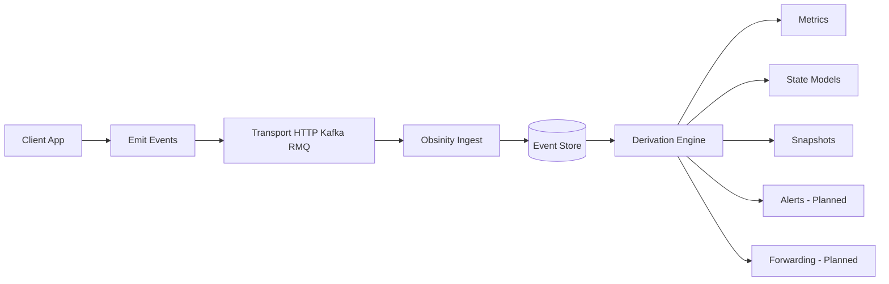

# Obsinity – End-to-End Event Derivation Walkthrough

> Obsinity Engine
> *Powering observability across all time. Where every signal lives forever.*

This document demonstrates a complete end-to-end flow:

```
Client Event Stream
        ↓
State Transitions
        ↓
Metric Buckets
        ↓
Query Output
```

It shows how raw events become:

* State models
* Transition counts
* Metric rollups
* Ratios
* Snapshot views

It also highlights:

* Late event correction
* Terminal state handling
* Config-driven derivation

---

# 1. Architecture Overview



## Implemented

* Event ingestion
* Durable event storage
* Config-driven metric rollups
* State models & transitions
* Watchdog-based state expiry
* Snapshot views
* Late event correction

## Not Yet Implemented

* Alert emission subsystem
* Transform & forward routing

---

# 2. Configuration

> **Note:** Event and metric names in Obsinity configs use `snake_case` (e.g., `order_created`, `payment_completed`).

### 2.1 Event Definitions

```yaml
---
apiVersion: obsinity/v1
kind: Event
metadata:
  service: payments
  name: order_created
  displayName: Order Created
  labels:
    category: order
spec:
  retention:
    ttl: "30d"
  schema:
    type: object
    properties:
      order:
        type: object
        properties:
          order_id: { type: string, index: true }
          customer_id: { type: string, index: true }
          status: { type: string, index: true }
---
apiVersion: obsinity/v1
kind: Event
metadata:
  service: payments
  name: payment_completed
  displayName: Payment Completed
  labels:
    category: payment
spec:
  retention:
    ttl: "30d"
  schema:
    type: object
    properties:
      payment:
        type: object
        properties:
          order_id: { type: string, index: true }
          amount: { type: number }
          status: { type: string, index: true }
---
apiVersion: obsinity/v1
kind: Event
metadata:
  service: payments
  name: payment_failed
  displayName: Payment Failed
  labels:
    category: payment
spec:
  retention:
    ttl: "30d"
  schema:
    type: object
    properties:
      payment:
        type: object
        properties:
          order_id: { type: string, index: true }
          reason: { type: string, index: true }
          status: { type: string, index: true }
```

---

### 2.2 State Extractors

```yaml
service: payments
stateExtractors:
  - rawType: order_created
    objectType: Order
    objectIdField: order.order_id
    stateAttributes:
      - order.status
  - rawType: payment_completed
    objectType: Order
    objectIdField: payment.order_id
    stateAttributes:
      - payment.status
  - rawType: payment_failed
    objectType: Order
    objectIdField: payment.order_id
    stateAttributes:
      - payment.status
```

#### Semantics

* State derived from events
* State extractors map event fields to object state
* Object state tracked by objectIdField

---

### 2.3 Metrics Configuration

```yaml
---
apiVersion: obsinity/v1
kind: MetricCounter
metadata:
  service: payments
  event: payment_completed
  name: payment_success_count
  displayName: Payment Success Count
  labels:
    category: payment
spec:
  sourceEvent:
    service: payments
    name: payment_completed
  key:
    dimensions:
      - payment.status
  rollup:
    windowing:
      granularities: ["1m", "5m", "1h", "1d", "7d"]
    operation: count
  attributeMapping:
    status: payment.status
---
apiVersion: obsinity/v1
kind: MetricCounter
metadata:
  service: payments
  event: payment_failed
  name: payment_failure_count
  displayName: Payment Failure Count
  labels:
    category: payment
spec:
  sourceEvent:
    service: payments
    name: payment_failed
  key:
    dimensions:
      - payment.status
  rollup:
    windowing:
      granularities: ["1m", "5m", "1h", "1d", "7d"]
    operation: count
  attributeMapping:
    status: payment.status
```

---

# 3. Event Stream Example

Five events across ~3 minutes, published using `/events/publish` endpoint.

```json
[
  {
    "resource": {
      "service": { "name": "payments" }
    },
    "event": { "name": "order_created" },
    "time": {
      "startedAt": "2026-02-11T10:00:04Z",
      "endedAt": "2026-02-11T10:00:04Z"
    },
    "attributes": {
      "order": {
        "order_id": "order-123",
        "customer_id": "cust-456",
        "status": "CREATED"
      }
    }
  },
  {
    "resource": {
      "service": { "name": "payments" }
    },
    "event": { "name": "order_processing_started" },
    "time": {
      "startedAt": "2026-02-11T10:01:01Z",
      "endedAt": "2026-02-11T10:01:01Z"
    },
    "attributes": {
      "order": {
        "order_id": "order-123",
        "status": "PROCESSING"
      }
    }
  },
  {
    "resource": {
      "service": { "name": "payments" }
    },
    "event": { "name": "payment_failed" },
    "time": {
      "startedAt": "2026-02-11T10:01:38Z",
      "endedAt": "2026-02-11T10:01:38Z"
    },
    "attributes": {
      "payment": {
        "order_id": "order-123",
        "reason": "insufficient_funds",
        "status": "FAILED"
      }
    }
  },
  {
    "resource": {
      "service": { "name": "payments" }
    },
    "event": { "name": "payment_completed" },
    "time": {
      "startedAt": "2026-02-11T10:02:08Z",
      "endedAt": "2026-02-11T10:02:08Z"
    },
    "attributes": {
      "payment": {
        "order_id": "order-124",
        "amount": 99.99,
        "status": "COMPLETED"
      }
    }
  },
  {
    "resource": {
      "service": { "name": "payments" }
    },
    "event": { "name": "payment_completed" },
    "time": {
      "startedAt": "2026-02-11T10:02:55Z",
      "endedAt": "2026-02-11T10:02:55Z"
    },
    "attributes": {
      "payment": {
        "order_id": "order-123",
        "amount": 149.99,
        "status": "COMPLETED"
      }
    },
    "note": "Late arrival (ingested at 10:03:15Z)"
  }
]
```

**Note:** Attributes can also be sent in flat dotted notation (e.g., `"payment.order_id": "order-123"`) instead of nested objects.

---

# 4. Derived State Transitions

State is extracted from events using the state extractors defined in section 2.2. Each event updates the state attributes of the Order object identified by `order_id`.

## 4.1 order-123 State Evolution

| Event                  | State Attribute      | Value       | Notes                                  |
| ---------------------- | -------------------- | ----------- | -------------------------------------- |
| order_created          | order.status         | CREATED     | Initial state                          |
| order_processing_start | order.status         | PROCESSING  | State updated                          |
| payment_failed         | payment.status       | FAILED      | Payment attempt failed                 |
| payment_completed (late)| payment.status      | COMPLETED   | Late arrival updates historical state  |

The late `payment_completed` event updates the state retroactively based on its timestamp.

---

## 4.2 order-124 State Evolution

| Event             | State Attribute | Value     | Notes         |
| ----------------- | --------------- | --------- | ------------- |
| payment_completed | payment.status  | COMPLETED | Direct success|

---

# 5. Metric Buckets (1m Buckets)

Buckets:

* 10:01
* 10:02
* 10:03

---

## 5.1 payment-failure-count

| Bucket | Count |
| ------ | ----- |
| 10:01  | 1     |
| 10:02  | 0     |
| 10:03  | 0     |

---

## 5.2 payment-success-count

Two successes at timestamps in 10:02 bucket:

* 10:02:08
* 10:02:55 (late but timestamp-based)

| Bucket | Before Late Arrival | After Late Arrival |
| ------ | ------------------- | ------------------ |
| 10:02  | 1                   | 2                  |

Late event updates prior bucket.

Metrics are not append-only.

---

## 5.3 payment-success-rate

Ratios are computed from counter queries:

```
success / (success + failure)
```

Query both `payment_success_count` and `payment_failure_count` counters, then compute the ratio:

| Bucket | Success | Failure | Rate |
| ------ | ------- | ------- | ---- |
| 10:01  | 0       | 1       | 0.0  |
| 10:02  | 2       | 0       | 1.0  |
| 10:03  | 0       | 0       | null |

**Note:** Ratio computation can be done client-side or via dashboard tooling (e.g., Grafana transformations).

---

# 6. Query Output Examples

## Response Format Overview

### HAL (Hypertext Application Language)

All Obsinity API responses follow the **HAL** standard, providing:

- **Hypermedia controls** via `links` object (HATEOAS)
- **Self-describing APIs** with embedded navigation
- **Pagination support** with `next`, `prev`, `first`, `last` links

### Dual Format Support

Obsinity supports two response formats controlled by the `format` query parameter:

1. **Row Format (default)**: Traditional JSON array of objects
   ```json
   {
     "rows": [
       { "state": "ACTIVE", "count": 100 },
       { "state": "PENDING", "count": 50 }
     ]
   }
   ```

2. **Columnar Format** (`format: "columnar"`): Apache Arrow-compatible columnar structure
   ```json
   {
     "data": {
       "schema": {
         "fields": [
           { "name": "state", "type": "string" },
           { "name": "count", "type": "integer" }
         ]
       },
       "data": {
         "state": ["ACTIVE", "PENDING"],
         "count": [100, 50]
       }
     },
     "rows": [
       { "state": "ACTIVE", "count": 100 },
       { "state": "PENDING", "count": 50 }
     ]
   }
   ```

**Benefits of Columnar Format:**
- **Efficient serialization** for large datasets
- **Native Arrow/Parquet compatibility** for data pipelines
- **Type-safe schema** embedded in response
- **Reduced payload size** for repeated field names
- **Both formats included** in response (columnar + rows)

### Grafana-Specific API

Obsinity provides dedicated Grafana endpoints optimized for dashboard queries:

- `/api/grafana/counters` - Counter metrics in Grafana frames format
- `/api/grafana/histograms` - Histogram percentiles in Grafana frames format
- `/api/grafana/state-transitions` - State transitions in Grafana frames format

These endpoints return data in Grafana's native data frame format for optimal dashboard performance.

---

## 6.1 Metric Counter Query

Query request to `/api/query/counters`:

```json
{
  "serviceKey": "payments",
  "eventType": "payment_completed",
  "counterName": "payment_success_count",
  "interval": "1m",
  "key": {
    "payment.status": ["COMPLETED"]
  },
  "limits": {
    "offset": 0,
    "limit": 10
  }
}
```

Response format (intervals with counts):

```json
{
  "count": 3,
  "total": 3,
  "limit": 10,
  "offset": 0,
  "data": [
    {
      "windowStart": "2026-02-11T10:01:00Z",
      "dimensions": { "payment.status": "COMPLETED" },
      "count": 0
    },
    {
      "windowStart": "2026-02-11T10:02:00Z",
      "dimensions": { "payment.status": "COMPLETED" },
      "count": 2
    },
    {
      "windowStart": "2026-02-11T10:03:00Z",
      "dimensions": { "payment.status": "COMPLETED" },
      "count": 0
    }
  ],
  "links": {
    "self": {
      "href": "/api/query/counters",
      "method": "POST",
      "body": {
        "serviceKey": "payments",
        "eventType": "payment_completed",
        "counterName": "payment_success_count",
        "interval": "1m",
        "key": { "payment.status": ["COMPLETED"] },
        "limits": { "offset": 0, "limit": 10 }
      }
    }
  }
}
```

**Notes:**
- HAL `links` object provides API navigation
- Add `"format": "columnar"` to request for columnar output
- Columnar format includes both `data` (columnar) and `rows` (traditional) representations

---

## 6.2 State Transition Query

Query request to `/api/query/state-transitions`:

```json
{
  "serviceKey": "payments",
  "objectType": "Order",
  "attribute": "order.status",
  "fromStates": ["(none)"],
  "toStates": ["CREATED", "PROCESSING", "COMPLETED", "FAILED"],
  "interval": "5s",
  "start": "2026-02-11T10:00:00Z",
  "end": "2026-02-11T10:05:00Z",
  "limits": {
    "offset": 0,
    "limit": 20
  },
  "format": "columnar"
}
```

Response format (columnar with full HAL pagination):

```json
{
  "count": 20,
  "total": 480,
  "limit": 20,
  "offset": 0,
  "data": {
    "schema": {
      "fields": [
        { "name": "from", "type": "string" },
        { "name": "to", "type": "string" },
        { "name": "fromState", "type": "string" },
        { "name": "toState", "type": "string" },
        { "name": "count", "type": "integer" }
      ]
    },
    "data": {
      "from": [
        "2026-02-11T10:00:00Z",
        "2026-02-11T10:00:00Z",
        "2026-02-11T10:00:05Z",
        "2026-02-11T10:00:05Z"
      ],
      "to": [
        "2026-02-11T10:00:05Z",
        "2026-02-11T10:00:05Z",
        "2026-02-11T10:00:10Z",
        "2026-02-11T10:00:10Z"
      ],
      "fromState": [
        "(none)",
        "(none)",
        "(none)",
        "(none)"
      ],
      "toState": [
        "CREATED",
        "PROCESSING",
        "CREATED",
        "PROCESSING"
      ],
      "count": [
        5,
        2,
        3,
        1
      ]
    }
  },
  "rows": [
    {
      "from": "2026-02-11T10:00:00Z",
      "to": "2026-02-11T10:00:05Z",
      "fromState": "(none)",
      "toState": "CREATED",
      "count": 5
    },
    {
      "from": "2026-02-11T10:00:00Z",
      "to": "2026-02-11T10:00:05Z",
      "fromState": "(none)",
      "toState": "PROCESSING",
      "count": 2
    },
    {
      "from": "2026-02-11T10:00:05Z",
      "to": "2026-02-11T10:00:10Z",
      "fromState": "(none)",
      "toState": "CREATED",
      "count": 3
    },
    {
      "from": "2026-02-11T10:00:05Z",
      "to": "2026-02-11T10:00:10Z",
      "fromState": "(none)",
      "toState": "PROCESSING",
      "count": 1
    }
  ],
  "links": {
    "self": {
      "href": "/api/query/state-transitions",
      "method": "POST",
      "body": {
        "serviceKey": "payments",
        "objectType": "Order",
        "attribute": "order.status",
        "fromStates": ["(none)"],
        "toStates": ["CREATED", "PROCESSING", "COMPLETED", "FAILED"],
        "interval": "5s",
        "start": "2026-02-11T10:00:00Z",
        "end": "2026-02-11T10:05:00Z",
        "limits": { "offset": 0, "limit": 20 },
        "format": "columnar"
      }
    },
    "first": {
      "href": "/api/query/state-transitions",
      "method": "POST",
      "body": {
        "serviceKey": "payments",
        "objectType": "Order",
        "attribute": "order.status",
        "fromStates": ["(none)"],
        "toStates": ["CREATED", "PROCESSING", "COMPLETED", "FAILED"],
        "interval": "5s",
        "start": "2026-02-11T10:00:00Z",
        "end": "2026-02-11T10:05:00Z",
        "limits": { "offset": 0, "limit": 20 },
        "format": "columnar"
      }
    },
    "next": {
      "href": "/api/query/state-transitions",
      "method": "POST",
      "body": {
        "serviceKey": "payments",
        "objectType": "Order",
        "attribute": "order.status",
        "fromStates": ["(none)"],
        "toStates": ["CREATED", "PROCESSING", "COMPLETED", "FAILED"],
        "interval": "5s",
        "start": "2026-02-11T10:00:00Z",
        "end": "2026-02-11T10:05:00Z",
        "limits": { "offset": 20, "limit": 20 },
        "format": "columnar"
      }
    },
    "last": {
      "href": "/api/query/state-transitions",
      "method": "POST",
      "body": {
        "serviceKey": "payments",
        "objectType": "Order",
        "attribute": "order.status",
        "fromStates": ["(none)"],
        "toStates": ["CREATED", "PROCESSING", "COMPLETED", "FAILED"],
        "interval": "5s",
        "start": "2026-02-11T10:00:00Z",
        "end": "2026-02-11T10:05:00Z",
        "limits": { "offset": 460, "limit": 20 },
        "format": "columnar"
      }
    }
  },
  "format": "columnar"
}
```

**Notes:**
- Full HAL pagination: `self`, `first`, `next`, `last` links with complete request bodies
- `"(none)"` indicates initial state (no previous state)
- `start` and `end` parameters for time range filtering
- Columnar format includes both `data` (columnar) and `rows` (traditional) representations
- `count` shows returned items (20), `total` shows all available items (480)
- Each link includes the complete query for reproducibility
- Grafana endpoint: `/api/grafana/state-transitions`

---

## 6.3 State Counts Query

Query request to `/api/query/state-counts` (current state snapshot):

```json
{
  "serviceKey": "payments",
  "objectType": "Order",
  "attribute": "payment.status",
  "states": ["NEW", "COMPLETED", "FAILED", "PENDING"],
  "limits": {
    "offset": 0,
    "limit": 20
  },
  "format": "columnar"
}
```

Response format (columnar with schema):

```json
{
  "count": 4,
  "total": 4,
  "limit": 20,
  "offset": 0,
  "data": {
    "schema": {
      "fields": [
        { "name": "state", "type": "string" },
        { "name": "count", "type": "integer" }
      ]
    },
    "data": {
      "state": ["NEW", "COMPLETED", "FAILED", "PENDING"],
      "count": [10, 25, 5, 8]
    }
  },
  "rows": [
    { "state": "NEW", "count": 10 },
    { "state": "COMPLETED", "count": 25 },
    { "state": "FAILED", "count": 5 },
    { "state": "PENDING", "count": 8 }
  ],
  "links": {
    "self": {
      "href": "/api/query/state-counts",
      "method": "POST",
      "body": {
        "serviceKey": "payments",
        "objectType": "Order",
        "attribute": "payment.status",
        "states": ["NEW", "COMPLETED", "FAILED", "PENDING"],
        "limits": { "offset": 0, "limit": 20 },
        "format": "columnar"
      }
    }
  },
  "format": "columnar"
}
```

**Notes:**
- Returns **current** state counts (point-in-time snapshot)
- No time dimension (unlike state-count-timeseries)
- Useful for "how many orders are in each state right now?"
- Columnar format available for efficient data transfer

---

## 6.4 State Count Time Series Query

Query request to `/api/query/state-count-timeseries`:

```json
{
  "serviceKey": "payments",
  "objectType": "Order",
  "attribute": "payment.status",
  "states": ["COMPLETED", "FAILED"],
  "interval": "1m",
  "limits": {
    "offset": 0,
    "limit": 10
  },
  "format": "columnar"
}
```

Response format (columnar with schema):

```json
{
  "count": 10,
  "total": 30,
  "limit": 10,
  "offset": 0,
  "data": {
    "schema": {
      "fields": [
        { "name": "from", "type": "string" },
        { "name": "to", "type": "string" },
        { "name": "state", "type": "string" },
        { "name": "count", "type": "integer" }
      ]
    },
    "data": {
      "from": [
        "2026-02-11T10:01:00Z",
        "2026-02-11T10:01:00Z",
        "2026-02-11T10:02:00Z",
        "2026-02-11T10:02:00Z"
      ],
      "to": [
        "2026-02-11T10:02:00Z",
        "2026-02-11T10:02:00Z",
        "2026-02-11T10:03:00Z",
        "2026-02-11T10:03:00Z"
      ],
      "state": [
        "COMPLETED",
        "FAILED",
        "COMPLETED",
        "FAILED"
      ],
      "count": [
        0,
        1,
        2,
        0
      ]
    }
  },
  "rows": [
    {
      "from": "2026-02-11T10:01:00Z",
      "to": "2026-02-11T10:02:00Z",
      "state": "COMPLETED",
      "count": 0
    },
    {
      "from": "2026-02-11T10:01:00Z",
      "to": "2026-02-11T10:02:00Z",
      "state": "FAILED",
      "count": 1
    },
    {
      "from": "2026-02-11T10:02:00Z",
      "to": "2026-02-11T10:03:00Z",
      "state": "COMPLETED",
      "count": 2
    },
    {
      "from": "2026-02-11T10:02:00Z",
      "to": "2026-02-11T10:03:00Z",
      "state": "FAILED",
      "count": 0
    }
  ],
  "links": {
    "self": {
      "href": "/api/query/state-count-timeseries",
      "method": "POST",
      "body": {
        "serviceKey": "payments",
        "objectType": "Order",
        "attribute": "payment.status",
        "states": ["COMPLETED", "FAILED"],
        "interval": "1m",
        "limits": { "offset": 0, "limit": 10 },
        "format": "columnar"
      }
    },
    "next": {
      "href": "/api/query/state-count-timeseries",
      "method": "POST",
      "body": {
        "serviceKey": "payments",
        "objectType": "Order",
        "attribute": "payment.status",
        "states": ["COMPLETED", "FAILED"],
        "interval": "1m",
        "limits": { "offset": 10, "limit": 10 },
        "format": "columnar"
      }
    }
  },
  "format": "columnar"
}
```

**Notes:**
- Response includes both `data` (columnar format with schema) and `rows` (row-oriented format)
- `format: "columnar"` in request enables Apache Arrow-compatible schema + column arrays
- Pagination via `links.next` with updated offset
- `count` shows returned items, `total` shows total available items

---

# 7. State Watchdog Example (Timeout-Driven State Change)

```yaml
watchdogs:
  - name: processing-timeout
    objectType: Order
    appliesWhenState:
      - attribute: order.status
        value: PROCESSING
    duration: 15m
    onExpiry:
      updateState:
        - attribute: order.status
          value: ABANDONED
      emitEvent: order_abandoned
```

Behavior:

* Timer starts when order.status becomes PROCESSING
* Cancelled if order.status changes to COMPLETED or FAILED
* On expiry:

    * Emit event
    * Update state attribute
    * Metrics automatically update based on the emitted event

No separate funnel system required.

---

# 8. Key Architectural Properties

1. Events are the primitive.
2. State is derived from events via state extractors.
3. Metrics are derived from events via metric definitions.
4. Ratios are computed from rollups.
5. Late events correct historical buckets and state.
6. State extractors track object state over time.
7. Configuration defines behavior.
8. Alerts and forwarding are planned extensions.

---

# 9. Important Engineering Note

Configuration defines behavior.

All configuration must be:

* Human reviewed
* Tested against realistic event streams
* Validated for late, duplicate, and out-of-order events
* Covered by automated integration tests

Derived systems are powerful but correctness depends on configuration accuracy.

---

# 10. Mental Model

> The client emits events.
> Obsinity stores them durably.
> Configuration interprets them into state attributes and metric buckets.
> Queries expose derived signals over any time window.
> Late events preserve correctness.

