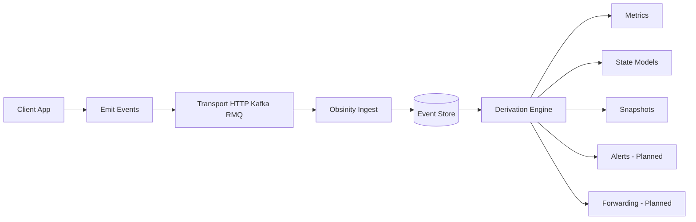

# Obsinity – End-to-End Event Derivation Walkthrough

> Obsinity Engine
> *Powering observability across all time. Where every signal lives forever.*

This document demonstrates a complete end-to-end flow:

```
Client Event Stream
        ↓
State Transitions
        ↓
Metric Buckets
        ↓
Query Output
```

It shows how raw events become:

* State models
* Transition counts
* Metric rollups
* Ratios
* Snapshot views

It also highlights:

* Late event correction
* Terminal state handling
* Config-driven derivation

---

# 1. Architecture Overview



## Implemented

* Event ingestion
* Durable event storage
* Config-driven metric rollups
* State models & transitions
* Watchdog-based state expiry
* Snapshot views
* Late event correction

## Not Yet Implemented

* Alert emission subsystem
* Transform & forward routing

---

# 2. Configuration

## 2.1 State Model – Order Lifecycle

```yaml
stateModels:
  - name: order-lifecycle
    entityKey: entityId
    initialState: CREATED

    transitions:
      - from: CREATED
        event: OrderProcessingStarted
        to: PROCESSING

      - from: PROCESSING
        event: PaymentCompleted
        to: COMPLETED
        terminal: true

      - from: PROCESSING
        event: PaymentFailed
        to: FAILED
        terminal: true
```

### Semantics

* State derived from events
* Terminal states prevent further transitions
* Invalid transitions may return: `REJECTED`

---

## 2.2 Metrics Configuration

```yaml
metrics:
  - name: payment-success-count
    sourceEvent: PaymentCompleted
    aggregation: count
    bucket: 1m

  - name: payment-failure-count
    sourceEvent: PaymentFailed
    aggregation: count
    bucket: 1m

  - name: payment-success-rate
    type: ratio
    numerator: payment-success-count
    denominator:
      - payment-success-count
      - payment-failure-count
```

---

# 3. Event Stream Example

Five events across ~3 minutes.

```json
[
  {
    "eventName": "OrderCreated",
    "entityId": "order-123",
    "timestamp": "2026-02-11T10:00:04Z"
  },
  {
    "eventName": "OrderProcessingStarted",
    "entityId": "order-123",
    "timestamp": "2026-02-11T10:01:01Z"
  },
  {
    "eventName": "PaymentFailed",
    "entityId": "order-123",
    "timestamp": "2026-02-11T10:01:38Z"
  },
  {
    "eventName": "PaymentCompleted",
    "entityId": "order-124",
    "timestamp": "2026-02-11T10:02:08Z"
  },
  {
    "eventName": "PaymentCompleted",
    "entityId": "order-123",
    "timestamp": "2026-02-11T10:02:55Z",
    "note": "Late arrival (ingested at 10:03:15Z)"
  }
]
```

---

# 4. Derived State Transitions

## 4.1 order-123

| Event                   | From → To            | Result        |
| ----------------------- | -------------------- | ------------- |
| OrderProcessingStarted  | CREATED → PROCESSING | OK            |
| PaymentFailed           | PROCESSING → FAILED  | OK (terminal) |
| PaymentCompleted (late) | FAILED → COMPLETED   | REJECTED      |

Since FAILED is terminal, the late success does not alter state.

State model enforces lifecycle integrity.

---

## 4.2 order-124

| Event            | From → To              |
| ---------------- | ---------------------- |
| PaymentCompleted | PROCESSING → COMPLETED |

---

# 5. Metric Buckets (1m Buckets)

Buckets:

* 10:01
* 10:02
* 10:03

---

## 5.1 payment-failure-count

| Bucket | Count |
| ------ | ----- |
| 10:01  | 1     |
| 10:02  | 0     |
| 10:03  | 0     |

---

## 5.2 payment-success-count

Two successes at timestamps in 10:02 bucket:

* 10:02:08
* 10:02:55 (late but timestamp-based)

| Bucket | Before Late Arrival | After Late Arrival |
| ------ | ------------------- | ------------------ |
| 10:02  | 1                   | 2                  |

Late event updates prior bucket.

Metrics are not append-only.

---

## 5.3 payment-success-rate

```
success / (success + failure)
```

| Bucket | Success | Failure | Rate |
| ------ | ------- | ------- | ---- |
| 10:01  | 0       | 1       | 0.0  |
| 10:02  | 2       | 0       | 1.0  |
| 10:03  | 0       | 0       | null |

---

# 6. Query Output Examples

## 6.1 Metric Query (Interval Format)

```json
{
  "meta": {
    "timezone": "UTC",
    "bucket": "1m"
  },
  "intervals": [
    { "start": "10:01", "value": 0 },
    { "start": "10:02", "value": 2 },
    { "start": "10:03", "value": 0 }
  ]
}
```

---

## 6.2 Ratio Query

```json
{
  "meta": {
    "formula": "success / (success + failure)"
  },
  "intervals": [
    { "start": "10:01", "value": 0.0 },
    { "start": "10:02", "value": 1.0 },
    { "start": "10:03", "value": null }
  ]
}
```

---

## 6.3 Transition Query

```json
{
  "transitions": [
    { "entityId": "order-123", "from": "CREATED", "to": "PROCESSING" },
    { "entityId": "order-123", "from": "PROCESSING", "to": "FAILED" },
    { "entityId": "order-124", "from": "PROCESSING", "to": "COMPLETED" }
  ]
}
```

---

# 7. Watchdog Example (Timeout-Driven Transition)

```yaml
watchdogs:
  - name: processing-timeout
    stateModel: order-lifecycle
    appliesWhenState: PROCESSING
    duration: 15m
    onExpiry:
      toState: ABANDONED
      emitEvent: OrderAbandoned
      terminal: true
```

Behavior:

* Timer starts on PROCESSING
* Cancelled on COMPLETED/FAILED
* On expiry:

    * Emit event
    * Transition state
    * Update counts automatically

No separate funnel system required.

---

# 8. Key Architectural Properties

1. Events are the primitive.
2. State is derived.
3. Metrics are derived.
4. Ratios are computed from rollups.
5. Late events correct historical buckets.
6. Terminal states enforce lifecycle integrity.
7. Configuration defines behavior.
8. Alerts and forwarding are planned extensions.

---

# 9. Important Engineering Note

Configuration defines behavior.

AI-assisted configuration must be:

* Human reviewed
* Tested against realistic event streams
* Validated for late, duplicate, and out-of-order events
* Covered by automated integration tests

Derived systems are powerful but correctness depends on configuration accuracy.

---

# 10. Mental Model

> The client emits events.
> Obsinity stores them durably.
> Configuration interprets them into state transitions and metric buckets.
> Queries expose derived signals over any time window.
> Late events preserve correctness.

---
